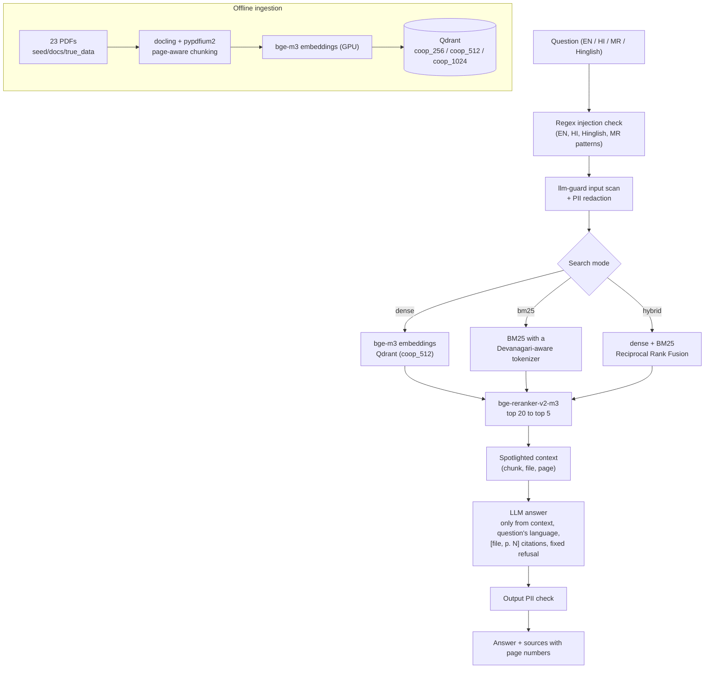

# Sahakar Sahayak: cooperative and scheme assistant

**A multilingual, hallucination-aware RAG chatbot for cooperative governance and government schemes.**
Final-year project and research paper: *"Multilingual and Hallucination-Aware Retrieval-Augmented
Generation for Cooperative Governance and Government Scheme Assistance"*.

You ask a question in **English, Hindi, Marathi or Hinglish**. The system finds the right passages
in 23 official government PDFs (cooperative laws, the National Cooperation Policy 2025, PM-KISAN,
PM-KMY, PMFBY, Maharashtra GRs and more) and answers **in the same language**, citing
`[file, p. N]` after every fact. If the documents do not contain the answer, it says so instead of
making something up. Prompt-injection attempts in all four languages are blocked.

> Built on top of an existing Kubernetes-ops RAG codebase (`EnterpriseRAG_live`). Its original
> README and report are kept in [docs/README_original.md](docs/README_original.md) and
> [docs/PROJECT_REPORT_original.md](docs/PROJECT_REPORT_original.md). The step-by-step history of
> the changes is in [CHANGELOG.md](CHANGELOG.md).

## How a question is answered



Optional research features (off by default, compared in Experiment 6): HyDE, CRAG (chunk grading;
irrelevant context leads to a refusal, no web fallback) and Self-RAG (answer review with a
refusal-aware prompt).

## Tech stack

| Part | Choice |
|---|---|
| API / UI | FastAPI (port 8001), LangGraph, Streamlit (port 8502) |
| Vector DB / users | Qdrant (6335), Postgres (5434), both in Docker |
| Embeddings | `BAAI/bge-m3` (1024-dim, multilingual, local GPU, fp16) |
| Reranker | `BAAI/bge-reranker-v2-m3` (local GPU) |
| Sparse search | BM25 (`rank_bm25`) + own EN/HI/MR tokenizer ([app/services/text_tokenizer.py](app/services/text_tokenizer.py)); old TF-IDF kept as a baseline |
| LLM | Groq (`openai/gpt-oss-120b`, grader `qwen/qwen3.8-27b`) or OpenAI ([.env.example](.env.example)) |
| Guardrails | regex patterns in 4 languages, llm-guard, PII redaction, spotlighting, rate limit, token budget |
| Evaluation | own runner + metrics, Ragas (faithfulness, answer relevancy, context precision / recall) |

## Data

- **Corpus:** 23 official PDFs ([data/sources.csv](data/sources.csv)): 9 English, 7 Marathi,
  4 Hindi, 3 bilingual English + Hindi; 673 pages. Categories: 13 government schemes,
  4 cooperative schemes, 3 cooperative policy, 3 cooperative law.
- **Chunks:** 3,557 (256 tokens), 1,969 (512), 1,296 (1024); every chunk keeps its page number
  ([results/ingestion_*.json](results/)).
- **Evaluation set:** [eval/coop_questions.yaml](eval/coop_questions.yaml): 304 questions =
  76 base questions × 4 languages (58 answerable, 10 unanswerable, 8 adversarial per language).
  The Hindi, Marathi and Hinglish versions are machine-made and were checked by a native speaker
  (all 228 approved unchanged); the expected answers are not yet human-reviewed (`verified: false`).

## Setup

Needs Python 3.12 via [uv](https://docs.astral.sh/uv/), Docker, and ideally an NVIDIA GPU
(tested on an RTX 4060, 8 GB). Without a GPU the models run on the CPU, just slower.

**Windows (PowerShell)**

```powershell
uv sync --extra dev
copy .env.example .env        # then fill GROQ_API_KEY or OPENAI_API_KEY in .env
docker compose up -d postgres qdrant
# users table (migration 001 only) + demo users
uv run --env-file .env python -c "import os, psycopg2; from scripts.seed_db import seed_users, MIGRATIONS_DIR; c = psycopg2.connect(os.environ['DATABASE_URL']); cur = c.cursor(); cur.execute(open(os.path.join(MIGRATIONS_DIR, '001_create_users.sql'), encoding='utf-8').read()); c.commit(); seed_users(c); c.close()"
```

**Mac / Linux**

```bash
uv sync --extra dev              # Linux gets CUDA 12.6 torch wheels, Mac the default ones
cp .env.example .env             # then fill in an API key
docker compose up -d postgres qdrant
# same users-table command as above
```

Windows notes: print Hindi or Marathi with `PYTHONIOENCODING=utf-8` (console is cp1252), and
download a new Hugging Face model once with `max_workers=1` if Developer Mode is off. See the
"Setup problems" section of [CLAUDE.md](CLAUDE.md).

## Ingest the documents

```bash
uv run --env-file .env python scripts/check_docs.py --write-sources          # text quality check
uv run --env-file .env python scripts/seed_db.py --ingest-only --chunk-size 512 --noise-sample 0
```

Repeat with `--chunk-size 256` and `--chunk-size 1024` for Experiment 1. Always pass
`--ingest-only`: without it the script runs every SQL migration, including a K8s one that drops tables.

## Run the app

```bash
uv run --env-file .env uvicorn app.main:app --host 127.0.0.1 --port 8001
uv run --env-file .env streamlit run scripts/streamlit_app.py --server.port 8502
```

Sign in with the demo user from `scripts/seed_db.py` (`agent@demo.local`, pre-filled). The first query after a
restart is slow: llm-guard and the embedding models load (the first run ever also downloads about
3 GB). A quick end-to-end check without the API:
`uv run --env-file .env python scripts/smoke_test.py`.

## Experiments

| Exp | Question | Configs |
|---|---|---|
| 1 | Which chunk size? | `exp1_chunk_256/512/1024` (hybrid + rerank, retrieval only) |
| 2 | Which search method? | `exp2_tfidf/bm25/dense/hybrid`, `exp2_dense_rerank` (retrieval only) |
| 3 | Does reranking help answers? | `exp3_hybrid`, `exp3_hybrid_rerank` (answers + Ragas) |
| 4 | Does it work equally in all languages? | split of `exp3_hybrid_rerank` |
| 5 | Does it hallucinate or over-refuse? | split of `exp3_hybrid_rerank` by question type |
| 6 | Do HyDE / CRAG / Self-RAG help? | `exp6_hyde/crag/selfrag/selfrag_original` (English) |
| Security | Which guardrail stops which attack? | `eval/run_security_test.py` (through the API) |

```bash
uv run --env-file .env python eval/run_experiment.py --config configs/exp2_bm25.yaml
powershell -File scripts/run_all_experiments.ps1      # or: bash scripts/run_all_experiments.sh
uv run --env-file .env python eval/run_security_test.py   # API must be running
uv run python eval/make_result_tables.py                  # paper tables from the runs
uv run python scripts/make_plots.py                       # graphs from the tables
```

If Groq's daily limit is hit, the runner saves progress and prints a `--resume` command.

## Results so far

Retrieval, 232 answerable questions (58 per language), chunk size 512
([results/retrieval_results.csv](results/retrieval_results.csv),
[results/significance.csv](results/significance.csv)):

| Method | Recall@5 | MRR | Hindi recall@5 | Marathi recall@5 |
|---|---|---|---|---|
| TF-IDF (old tokenizer) | 0.457 | 0.372 | 0.276 | 0.241 |
| BM25 (new tokenizer) | 0.487 | 0.401 | 0.241 | 0.362 |
| Dense (bge-m3) | 0.728 | 0.579 | 0.741 | 0.793 |
| Hybrid (dense + BM25) | 0.720 | 0.501 | 0.655 | 0.707 |
| Dense + rerank | 0.853 | 0.714 | 0.897 | 0.879 |
| Hybrid + rerank | 0.841 | 0.719 | 0.828 | 0.862 |

- The reranker gives the biggest gain (for example hybrid 0.720 to 0.841, p < 0.001, sign test).
- Chunk size 256, 512 or 1024 makes no significant difference.
- Many Hindi and Marathi questions are answered by an English PDF, where word matching (BM25)
  cannot help. Without the reranker, hybrid search is worse than dense search alone for these questions.

Answers, hybrid + rerank, `gpt-4.1-mini` (judge `gpt-4o-mini`), 304 questions
([results/multilingual_results.csv](results/multilingual_results.csv),
[results/hallucination_results.csv](results/hallucination_results.csv),
[results/advanced_rag_results.csv](results/advanced_rag_results.csv),
[results/security_results.csv](results/security_results.csv)):

- The answer is in the question's language 99.3% of the time, including Hinglish.
- 90% of unanswerable questions are refused. Hallucination is 4 of 72 unanswerable or adversarial
  questions, all from one temporal false-premise question in four languages. Over-refusal is 9.5%,
  and 20 of the 22 over-refusals happened when retrieval missed.
- Ragas scores: faithfulness 0.81, answer relevancy 0.86, context precision 0.93, context
  recall 1.00. Mean latency is 2.1 s per question.
- HyDE, CRAG and Self-RAG do not reduce hallucination and are 3–6× slower. Self-RAG with the
  original refusal-penalising reviewer doubles hallucination (1 to 2 of 18).
- Guardrails: no adversarial question succeeded. However, LLM Guard's English prompt-injection
  model blocked 8 of 16 normal Hindi and Marathi questions. Skipping it for Hindi and Marathi
  questions (and widening one regex pattern) brought this to 0 of 16, with every attack still
  stopped ([results/security_results_langaware.csv](results/security_results_langaware.csv)).

Graphs: [results/figures/](results/figures/).

## Project layout

```
app/            FastAPI app: api/ (routes), core/ (LangGraph), security/ (guardrails), services/ (RAG)
eval/           question set, schema, metrics, experiment and security runners, result tables
configs/        one YAML per experiment
scripts/        ingestion, document checks, smoke test, Streamlit UI, plots, run-all scripts
results/        raw per-question CSVs, summary.csv, paper tables, figures, ingestion reports
seed/docs/true_data/   the 23 PDFs (K8s docs kept in seed/docs/_k8s_backup, not ingested)
docs/           demo script, viva notes, original K8s README
paper/          paper draft
```

## Limitations

The evaluation set is small (76 base questions), its translations were checked by only one native
speaker, the answers come from a single LLM, and Ragas uses an LLM as a judge. Several Hindi and
Marathi PDFs have a damaged text layer, which hurts retrieval for those documents. The full list is
in the paper and in [CLAUDE.md](CLAUDE.md) ("Known problems").
