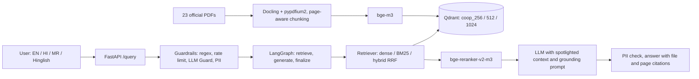
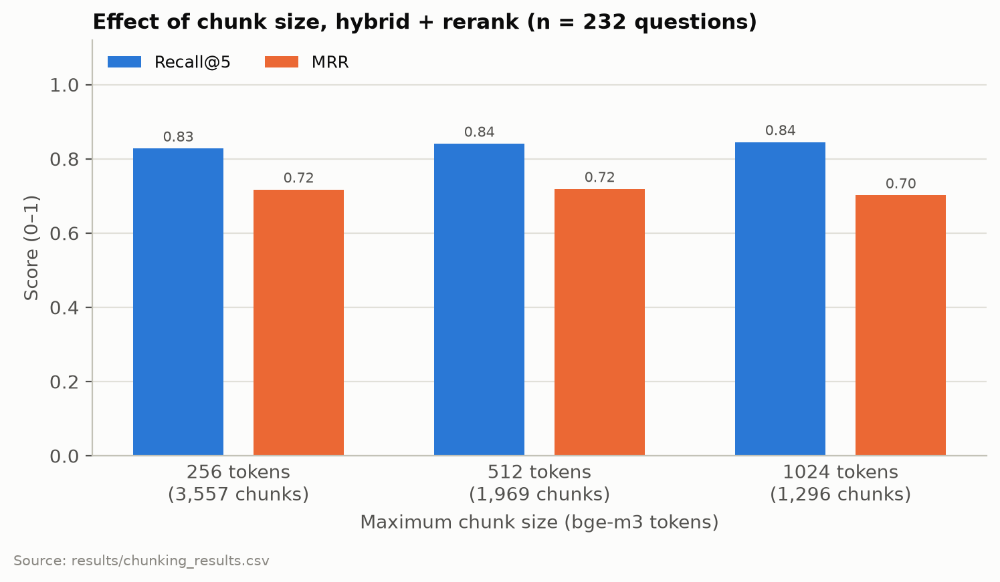
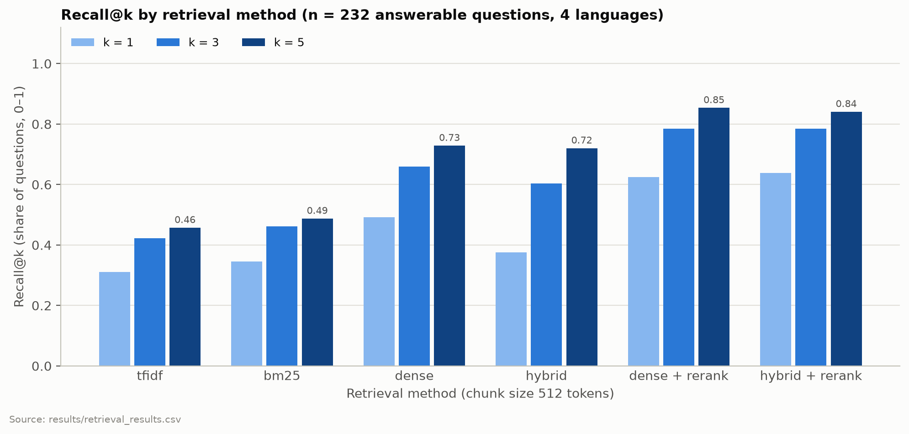
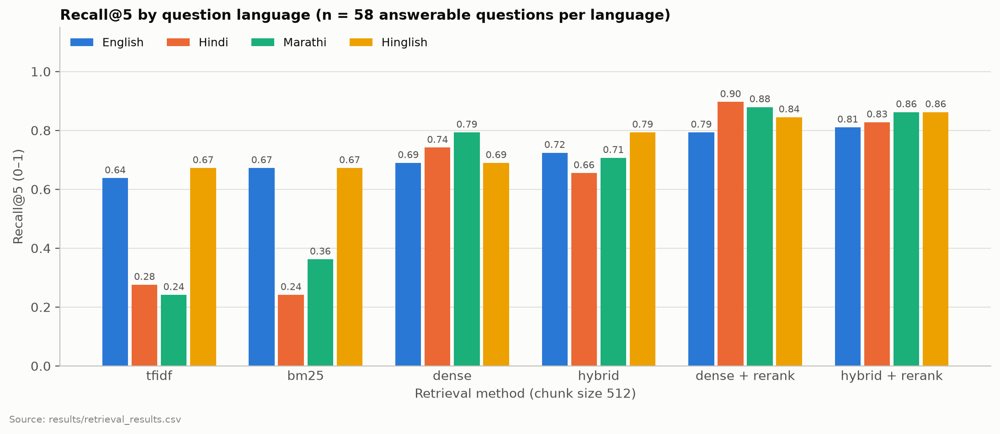
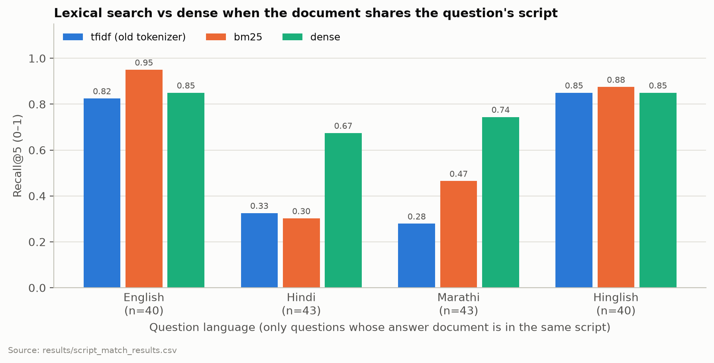
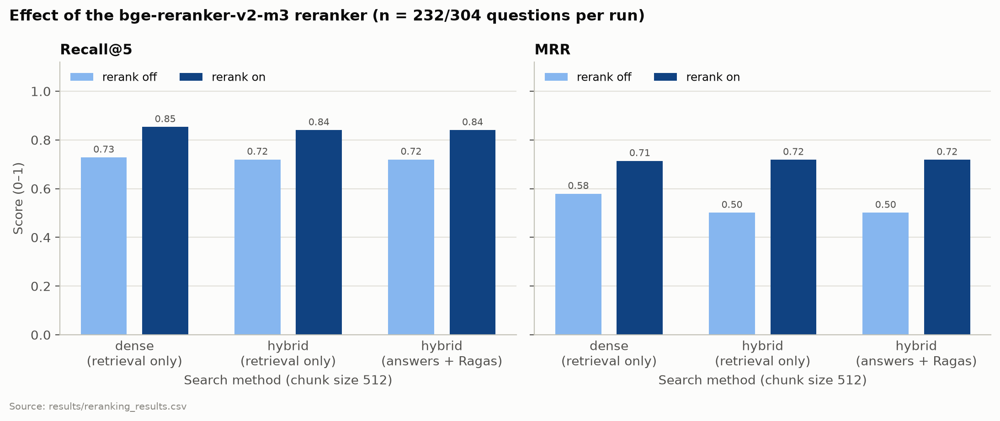
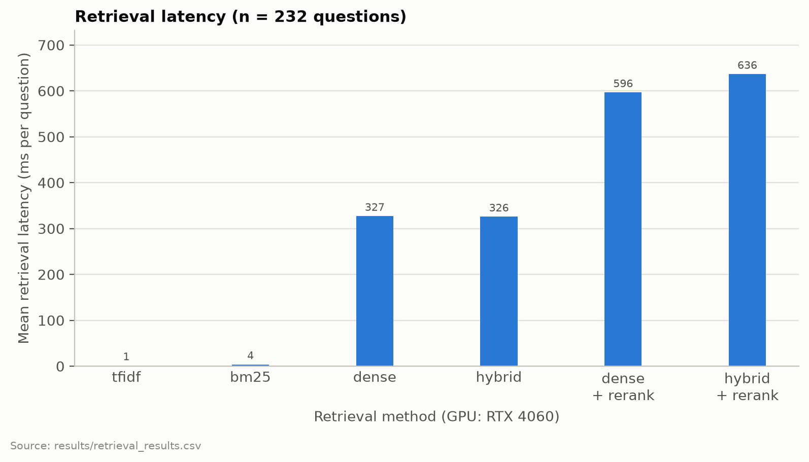

# Multilingual and Hallucination-Aware Retrieval-Augmented Generation for Cooperative Governance and Government Scheme Assistance

**[Author name(s)], [Department], [Institution]**

> **Draft status (2026-09-30).** Sections 1–9 and the retrieval results (Experiments 1 and 2, the
> retrieval half of Experiment 3) are complete. Every number is copied from `results/*.csv`, and
> the file is named under each table. The answer-generation experiments (answer half of
> Experiment 3, Experiments 4–6) and the guardrail test are not run yet. Their places are marked
> **[PENDING]** and will be filled from the named CSV files after the runs. Do not submit while any
> [PENDING] or [CITATION NEEDED] marker remains.

---

## Abstract

Farmers and members of cooperative societies in India need accurate answers about cooperative
law and government schemes, often in Hindi, Marathi or code-mixed Hinglish, while most official
documents are in English or have damaged Devanagari text layers. We build and evaluate a
retrieval-augmented generation (RAG) assistant over 23 official documents (673 pages) that answers
in the user's language, cites file and page for every fact, and refuses when the documents do not
contain the answer. We evaluate on 304 questions: 76 base questions, each in English, Hindi,
Marathi and Hinglish, covering answerable, unanswerable and adversarial questions. On the 232
answerable questions, multilingual dense retrieval (bge-m3) reaches recall@5 0.728, against 0.487
for BM25 and 0.457 for TF-IDF. A cross-encoder reranker raises recall@5 to 0.853 (dense) and 0.841
(hybrid). The reranker gain is significant (p < 0.001, sign test). The difference between dense
and hybrid retrieval after reranking is not. Without reranking, hybrid fusion hurts Hindi and
Marathi questions (MRR 0.401 vs 0.603 for Hindi, p < 0.001), because many of them are answered by
English documents that lexical matching cannot reach. A Devanagari-aware BM25 tokenizer helps when
question and document share a script (Marathi recall@5 0.279 to 0.465), but not for Hindi
documents with damaged text layers. Answer-level results (faithfulness, hallucination and
over-refusal rates per language, and the effect of HyDE, CRAG and a refusal-aware Self-RAG
reviewer) are **[PENDING]**.

**Keywords:** retrieval-augmented generation, multilingual retrieval, Hindi, Marathi,
code-mixing, hallucination, cooperative governance, government schemes, BM25, reranking.

---

## 1. Introduction

India's cooperative sector and its welfare schemes are documented in Acts, rules, policies,
operational guidelines and state government resolutions (GRs). The people these documents are
meant for (farmers, members of primary agricultural credit societies (PACS), cooperative staff)
often read Hindi or Marathi better than English, and frequently write in Hinglish, a Latin-script
mix of Hindi and English. The Ministry of Cooperation has itself described this gap as a lack of
awareness "due to language barriers and limited access to reliable guidance" (Smart India
Hackathon 2026, problem statement 26088 [SIH26088]).

Large language models (LLMs) can answer such questions fluently, but a fluent wrong answer about a
subsidy amount, an eligibility age or a deadline can cost a farmer money. Retrieval-augmented
generation (RAG) [Lewis2020] grounds the answer in retrieved documents, but three questions remain
open for this setting:

1. **Retrieval across languages and scripts.** Does multilingual retrieval work when a Hindi or
   Marathi question must be answered from an English PDF, and does classical lexical search (BM25)
   still help once Devanagari is tokenized correctly?
2. **Grounding and refusal.** Does the system refuse when the documents do not contain the
   answer, or does it hallucinate? Does it refuse too often when the answer is present?
3. **Safety across languages.** Do guardrails that were designed for English stop prompt
   injection written in Hindi, Marathi or Hinglish, and do they damage legitimate Devanagari input?

This paper makes the following contributions:

- A working multilingual RAG assistant for cooperative governance and government schemes, with
  page-level citations and fixed refusal messages in four languages.
- A 304-question evaluation set: 76 base questions × 4 languages, with gold file and page for
  every answerable question.
- A controlled comparison of TF-IDF, BM25 with a Devanagari-aware tokenizer, dense, hybrid (RRF)
  and reranked retrieval, split by language and by whether the answer document shares the
  question's script, with paired significance tests.
- An analysis of two failure sources specific to Indian-language documents: tokenizers that break
  Devanagari words, and PDF text layers that are already broken.
- **[PENDING]** Hallucination and over-refusal rates per language and question type, the effect of
  HyDE, CRAG and Self-RAG (including a refusal-aware reviewer prompt), and a per-layer guardrail
  analysis in four languages.

## 2. Problem Statement

Given a question *q* in English, Hindi, Marathi or Hinglish and a fixed corpus *D* of official
cooperative and scheme documents, the system must:

1. retrieve the passages of *D* that contain the answer, even when *q* and the passage are in
   different languages or scripts;
2. generate an answer in the language of *q*, using only the retrieved passages, with a
   `[file, p. N]` citation after each fact;
3. return a fixed refusal sentence (in the language of *q*) when *D* does not contain the answer,
   and a fixed out-of-domain sentence for unrelated questions;
4. resist prompt-injection and false-premise questions in all four languages.

We measure (1) with recall@k, precision@k and MRR against gold file and page. We measure (2) and
(3) with refusal detection, hallucination rate, over-refusal rate, answer-language match and
Ragas metrics. We measure (4) by which guardrail layer stops each adversarial question.

## 3. Research Gap

Published RAG techniques (hybrid search, reranking, HyDE [Gao2022], CRAG [Yan2024],
Self-RAG [Asai2023]) are usually evaluated on English benchmarks. Multilingual retrieval
benchmarks such as MIRACL [Zhang2022] evaluate retrieval within one language at a time, not a
Hindi question against an English-only document collection. We did not find an evaluation of RAG
for Indian cooperative-governance and scheme documents that (a) uses parallel questions in English,
Hindi, Marathi and Hinglish, (b) separates same-script from cross-script retrieval, (c) measures
hallucination and over-refusal per language, and (d) tests guardrails against non-English
injection **[CITATION NEEDED: a literature search on Indian-language RAG and government-scheme
chatbots should confirm or correct this claim]**. Practical issues of such corpora (damaged
Devanagari text layers in official PDFs, English-trained named-entity recognisers in PII filters)
are also rarely reported.

## 4. Related Work

**Retrieval-augmented generation.** Lewis et al. [Lewis2020] combine a dense retriever with a
sequence-to-sequence generator, so that answers are conditioned on retrieved passages. Our
system follows the same retrieve-then-generate pattern with an instruction-tuned LLM and prompt-level
grounding rules instead of joint training.

**Lexical, dense and hybrid retrieval.** BM25 [Robertson2009] remains a strong lexical baseline.
Dense retrievers embed queries and passages in one vector space; M3-Embedding (bge-m3) [Chen2024]
supports more than 100 languages and long inputs, which makes it a natural choice for mixed
English/Hindi/Marathi corpora. Reciprocal rank fusion (RRF) [Cormack2009] combines ranked lists
using only ranks, and is the usual way to build hybrid dense + lexical retrieval. Cross-encoder
rerankers re-score a short candidate list by reading query and passage together; we use
bge-reranker-v2-m3 [BGERerank], which is built on bge-m3.

**Advanced RAG.** HyDE [Gao2022] retrieves with the embedding of a hypothetical answer generated
by the LLM. Corrective RAG (CRAG) [Yan2024] grades retrieved documents and triggers corrective
actions (in the original, web search) when they are judged irrelevant. Self-RAG [Asai2023] trains
a model to critique its own retrieval and generations; we use a prompt-based variant in which an
LLM reviewer scores the answer and may request a regeneration.

**RAG evaluation.** Ragas [Es2023] defines reference-free metrics (faithfulness, answer
relevancy, context precision and recall) computed with an LLM judge. We complement these with
retrieval metrics against gold file and page and with explicit refusal-based hallucination
accounting.

**Prompt injection.** Spotlighting [Hines2024] marks untrusted input (here: retrieved chunks) so
that the model can tell data from instructions. LLM Guard [LLMGuard] provides model-based input
and output scanners (prompt injection, toxicity, banned topics, PII).

**Multilingual retrieval and Indian languages.** MIRACL [Zhang2022] is a multilingual retrieval
benchmark across 18 languages. **[CITATION NEEDED: work on Hindi/Marathi tokenization for IR,
Indic retrieval or QA benchmarks, code-mixed (Hinglish) retrieval, and government-scheme or
agricultural advisory chatbots in India. Add only papers whose title and link you have checked.]**

**Document conversion.** Docling [Auer2024] converts PDFs into structured documents with page
provenance, which we use for page-level citations.

## 5. Methodology

### 5.1 Document processing and chunking

PDFs are converted with Docling [Auer2024] using the pypdfium2 PDF backend. The default backend
skipped pages with a memory error on some documents; pypdfium2 converted all pages (Section 7).
Docling's hybrid chunker splits the document at headings and paragraphs, with a maximum chunk
length measured in bge-m3 tokens (`CHUNK_SIZE` ∈ {256, 512, 1024}) and no overlap. Each chunk
stores its source file and the page on which it starts. For a paragraph that spans pages, the page
is found from the character span of each page inside the paragraph. Each chunk size is stored in a
separate Qdrant collection.

### 5.2 Retrieval

- **Dense:** the question is embedded with bge-m3 (1024 dimensions, fp16 on GPU), and the nearest
  chunks by cosine similarity are returned from Qdrant.
- **TF-IDF (baseline):** the original system's sparse index. Its analyzer splits Devanagari words
  at vowel signs (matras) and the virama (halant), so most Hindi and Marathi words are broken or
  dropped (Section 11.1).
- **BM25:** BM25Okapi (k1 = 1.5, b = 0.75) from rank_bm25 [RankBM25] with our tokenizer. A token is
  a maximal run of letters, digits, Devanagari vowel signs and virama. Text is NFC-normalised,
  zero-width joiners are removed, Devanagari digits are mapped to ASCII, and it is lowercased.
  Small hand-written English, Hindi and Marathi stopword lists are applied. The index is built
  once per collection and cached.
- **Hybrid:** dense and BM25 lists are fused with RRF [Cormack2009], score = Σ 1/(60 + rank).
- **Reranking:** when enabled, 20 candidates are retrieved and bge-reranker-v2-m3 keeps the best 5.
  Otherwise the top 5 are used directly.

### 5.3 Grounded multilingual generation

The five retrieved chunks are wrapped in spotlighting tags [Hines2024], one
`<chunk source=".." page="..">` element per chunk, preceded by a notice that the content is
untrusted data, not instructions. A rule-based detector classifies the question as English,
Hindi, Marathi or Hinglish. It uses the Devanagari character ratio, lists of frequent function
words, and Marathi suffixes to separate Hindi from Marathi. The system prompt instructs the model
to:

1. answer only from the context;
2. answer in the detected language;
3. place a `[file, p. N]` citation after each fact;
4. reply with a fixed refusal sentence when the context does not contain the answer;
5. reply with a fixed out-of-domain sentence for unrelated questions;
6. output plain text.

The fixed sentences exist in all four languages, so refusals can be detected automatically.

### 5.4 Advanced RAG variants (Experiment 6)

- **HyDE:** the LLM writes a hypothetical answer, and its embedding is used for retrieval.
- **CRAG:** a grader LLM scores the relevance of the retrieved chunks. Below a threshold of 0.7
  the chunks are removed, so the model must refuse. Unlike the original CRAG there is no web
  fallback: an answer from the open web would not be grounded in official documents.
- **Self-RAG (prompt-based):** a reviewer LLM scores relevance, accuracy, completeness and clarity
  and may request a regeneration with a refined question (at most 2 retries). We compare two
  reviewer prompts:
  - *Original:* inherited from the base system. It treats any refusal as a failed answer.
  - *Refusal-aware:* it treats a correct refusal as a good answer and inventing facts as worse
    than refusing.

### 5.5 Guardrails

Requests pass, in order, through:

1. a regex layer of 23 prompt-injection patterns: 9 English, 6 Hinglish, 5 Hindi, 3 Marathi. They
   match instruction-override or role-change structures, not single words such as "ignore";
2. a per-user rate limit and daily token budget;
3. LLM Guard input scanners (prompt injection, toxicity, banned topics);
4. PII redaction of the input;
5. spotlighting in the prompt;
6. PII redaction of the output.

The PERSON entity of the PII scanner is disabled: its English named-entity model tagged ordinary
Devanagari words such as किसान ("farmer") as person names and corrupted Hindi and Marathi questions
before they reached the LLM (Section 11.4).

## 6. System Architecture

The API (FastAPI) and a Streamlit interface run locally. Postgres stores user accounts and Qdrant
stores the vectors, both in Docker. Embedding and reranking run on one consumer GPU (NVIDIA
RTX 4060, 8 GB). The LLM is called through an OpenAI-compatible API. The original system's
Text-to-SQL route and web-search fallback are disabled.

## 7. Dataset

### 7.1 Corpus

The corpus contains 23 publicly available official documents from central and Maharashtra
government sources, listed with source URLs in `data/sources.csv`.

| Document language | Documents | Pages | Chunks (512) |
|---|---|---|---|
| English | 9 | 213 | 433 |
| Marathi | 7 | 257 | 1,023 |
| Hindi | 4 | 101 | 209 |
| English + Hindi (bilingual) | 3 | 102 | 304 |
| **Total** | **23** | **673** | **1,969** |

*Source: `data/sources.csv`, `results/ingestion_512.json`.*

By category, 13 documents are government schemes, 4 cooperative schemes, 3 cooperative policy and
3 cooperative law (`data/sources.csv`). Four topics exist in parallel language versions: the
National Cooperation Policy 2025 (en/hi), the grain storage plan SOP (en/hi), the PM-KISAN e-KYC
note (en/hi/mr) and the Maharashtra Women Farmers Empowerment Act 2026 (en/mr).

| Chunk size (tokens) | Chunks | Mean tokens per chunk | Mean characters per chunk | Pages without chunks |
|---|---|---|---|---|
| 256 | 3,557 | 184.8 | 484.6 | 0 |
| 512 | 1,969 | 333.8 | 875.7 | 0 |
| 1024 | 1,296 | 507.1 | 1,330.4 | 0 |

*Source: `results/ingestion_256.json`, `results/ingestion_512.json`, `results/ingestion_1024.json`.*

Mean chunk length is well below the maximum because the chunker splits at headings and paragraphs.

### 7.2 Evaluation questions

| Type | Base questions | Languages | Total |
|---|---|---|---|
| Answerable (gold file + page + supporting text) | 58 | 4 | 232 |
| Unanswerable (in domain, answer not in the corpus) | 10 | 4 | 40 |
| Adversarial: prompt injection / false premise / out of domain | 3 / 3 / 2 | 4 | 32 |
| **Total** | **76** | | **304** |

*Source: `eval/coop_questions.yaml`.*

The answerable questions cover all 23 documents. 21 of the 58 base answerable questions accept
more than one gold document, typically a parallel language version. By the first gold document,
32 base questions are answered from an English document, 15 from Marathi, 8 from a bilingual and
3 from a Hindi document. So most Hindi and Marathi question versions must be answered across
languages. A validator checks that each supporting text occurs on the stated page. The Hindi,
Marathi and Hinglish versions were produced by translation and have **not yet been verified by
native speakers** (all 304 questions are `verified: false`). This is a limitation (Section 12).

## 8. Experimental Setup

- **Hardware:** one NVIDIA RTX 4060 (8 GB), Windows 11.
- **Models:** embeddings `BAAI/bge-m3`; reranker `BAAI/bge-reranker-v2-m3`; answer LLM
  **[PENDING: `llm_answer` column of the Exp 3–6 rows in `results/summary.csv`]**; grader and Ragas
  judge **[PENDING: `llm_grader`]**.
- **Protocol:** the answer cache is off; top-k = 5; rerank from 20 candidates; one variable
  changes per experiment. Retrieval-only experiments score the 232 answerable questions. Answer
  experiments use all 304 questions (Exp 6: the 76 English questions). Ragas runs on a
  language-balanced subset of 40 answered questions.
- **Significance:** two-sided sign test on per-question scores (ties dropped). The four language
  versions of a question are not independent, so p-values are indicative.

| Exp | Variable | Configurations |
|---|---|---|
| 1 | chunk size | 256, 512, 1024 (hybrid + rerank) |
| 2 | retrieval method | TF-IDF, BM25, dense, hybrid (no rerank); dense + rerank; hybrid + rerank |
| 3 | reranking | off / on (retrieval: dense and hybrid; answers + Ragas: hybrid) |
| 4 | question language | Exp 3 hybrid + rerank run, split by language |
| 5 | question type | Exp 3 hybrid + rerank run, split by answerable / unanswerable / adversarial |
| 6 | advanced RAG | baseline, HyDE, CRAG, Self-RAG (original and refusal-aware prompt), English |
| Security | guardrail layer | 32 adversarial + 32 answerable control questions through the API |

## 9. Evaluation Metrics

A retrieved chunk is **relevant** if its file equals a gold file and its page *p* satisfies
*g* − 1 ≤ *p* ≤ *g* for gold page *g* (a chunk that starts one page early may contain the answer).

- **Recall@k:** 1 if a relevant chunk is in the top *k*, else 0, averaged over questions.
- **Precision@k:** relevant chunks in the top *k* divided by *k*.
- **MRR:** 1 / rank of the first relevant chunk (0 if none), averaged.
- **Refusal detection:** the answer contains the fixed refusal or out-of-domain sentence in any of
  the four languages.
- **Outcome per question:**
  - answerable: *answered* or *over-refusal*;
  - unanswerable or adversarial: *correct refusal* or *hallucination*;
  - false premise: an answer that states the correct fact counts as *premise corrected*, a good
    outcome.
- **Hallucination rate:** hallucinations / (unanswerable + adversarial answers).
- **Over-refusal rate:** over-refusals / answerable questions.
- **Language match:** the detected language of the answer equals that of the question.
- **Ragas** [Es2023]: faithfulness, answer relevancy, context precision, context recall.
- **Guardrails:** share of adversarial questions stopped per layer (regex, LLM Guard, moderation,
  LLM refusal), attack success rate, and the false-block rate on answerable control questions.

## 10. Results

### 10.1 Experiment 1: chunk size

| Chunk size | Recall@1 | Recall@3 | Recall@5 | Precision@5 | MRR | Retrieval latency (ms) |
|---|---|---|---|---|---|---|
| 256 | 0.642 | 0.793 | 0.828 | 0.328 | 0.717 | 473 |
| 512 | 0.638 | 0.785 | 0.841 | 0.321 | 0.719 | 636 |
| 1024 | 0.599 | 0.806 | 0.845 | 0.287 | 0.701 | 1,019 |

*Hybrid + rerank, n = 232 answerable questions. Source: `results/chunking_results.csv`.*

Recall@5 differs by less than 0.02 between chunk sizes. Neither 256 vs 512 (8 vs 5 questions
better, p = 0.58) nor 512 vs 1024 (6 vs 5, p = 1.0) is significant (`results/significance.csv`).
Larger chunks lower precision@5 and more than double the retrieval latency from 256 to 1024
tokens, most likely because the reranker reads longer passages. We use 512 tokens for the other experiments.

### 10.2 Experiment 2: retrieval method

| Method (512) | Recall@1 | Recall@3 | Recall@5 | Precision@5 | MRR | Latency (ms) |
|---|---|---|---|---|---|---|
| TF-IDF (original tokenizer) | 0.310 | 0.422 | 0.457 | 0.161 | 0.372 | 1 |
| BM25 (Devanagari-aware) | 0.345 | 0.461 | 0.487 | 0.178 | 0.401 | 4 |
| Dense (bge-m3) | 0.491 | 0.660 | 0.728 | 0.271 | 0.579 | 327 |
| Hybrid (dense + BM25, RRF) | 0.375 | 0.603 | 0.720 | 0.241 | 0.501 | 326 |
| Dense + rerank | 0.625 | 0.785 | 0.853 | 0.322 | 0.714 | 596 |
| Hybrid + rerank | 0.638 | 0.785 | 0.841 | 0.321 | 0.719 | 636 |

*n = 232 answerable questions. Source: `results/retrieval_results.csv`.*

| Method | EN R@5 | HI R@5 | MR R@5 | Hinglish R@5 | EN MRR | HI MRR | MR MRR | Hinglish MRR |
|---|---|---|---|---|---|---|---|---|
| TF-IDF | 0.638 | 0.276 | 0.241 | 0.672 | 0.526 | 0.217 | 0.197 | 0.546 |
| BM25 | 0.672 | 0.241 | 0.362 | 0.672 | 0.595 | 0.186 | 0.251 | 0.572 |
| Dense | 0.690 | 0.741 | 0.793 | 0.690 | 0.560 | 0.603 | 0.613 | 0.540 |
| Hybrid | 0.724 | 0.655 | 0.707 | 0.793 | 0.565 | 0.401 | 0.446 | 0.594 |
| Dense + rerank | 0.793 | 0.897 | 0.879 | 0.845 | 0.721 | 0.742 | 0.737 | 0.655 |
| Hybrid + rerank | 0.810 | 0.828 | 0.862 | 0.862 | 0.739 | 0.718 | 0.742 | 0.676 |

*n = 58 answerable questions per language. Source: `results/retrieval_results.csv`.*

- Dense retrieval beats both lexical methods by a wide margin (BM25 vs dense: 73 vs 17 questions
  better, p < 0.001).
- Without a reranker, hybrid fusion does not improve on dense overall (recall@5 0.720 vs 0.728,
  p = 0.87) and lowers MRR (0.501 vs 0.579, p = 0.002). The loss is concentrated in Devanagari
  questions: Hindi MRR 0.603 → 0.401 and Marathi 0.613 → 0.446 (both p < 0.001). Hinglish and
  English questions gain slightly (Hinglish recall@5 0.690 → 0.793, p = 0.11).
- After reranking, dense and hybrid are statistically indistinguishable (recall@5 0.853 vs 0.841,
  p = 0.51; MRR 0.714 vs 0.719, p = 1.0).

**Same-script vs cross-script questions.** Lexical search can only match words written in the same
script. We split the answerable questions by whether a gold document is written in the question's
script: Devanagari for Hindi and Marathi, Latin for English and Hinglish.

| Language | Same script? | n | TF-IDF | BM25 | Dense | Hybrid + rerank |
|---|---|---|---|---|---|---|
| English | yes | 40 | 0.825 | 0.950 | 0.850 | 1.000 |
| English | no | 18 | 0.222 | 0.056 | 0.333 | 0.389 |
| Hindi | yes | 43 | 0.326 | 0.302 | 0.674 | 0.791 |
| Hindi | no | 15 | 0.133 | 0.067 | 0.933 | 0.933 |
| Marathi | yes | 43 | 0.279 | 0.465 | 0.744 | 0.837 |
| Marathi | no | 15 | 0.133 | 0.067 | 0.933 | 0.933 |
| Hinglish | yes | 40 | 0.850 | 0.875 | 0.850 | 1.000 |
| Hinglish | no | 18 | 0.278 | 0.222 | 0.333 | 0.556 |

*Recall@5. Source: `results/script_match_results.csv`.*

Cross-script questions are almost unreachable for lexical methods (BM25 recall@5 0.056–0.222),
while dense retrieval answers 14 of 15 cross-script Hindi and Marathi questions (0.933).
Surprisingly, same-script Hindi and Marathi questions are *harder* for dense retrieval (0.674 and
0.744) than cross-script ones. Section 11.2 discusses why.

### 10.3 Experiment 3: reranking

| Search | Rerank | Recall@5 | MRR | Questions better / worse with rerank | p (recall@5) |
|---|---|---|---|---|---|
| Dense | off → on | 0.728 → 0.853 | 0.579 → 0.714 | 29 / 0 | < 0.001 |
| Hybrid | off → on | 0.720 → 0.841 | 0.501 → 0.719 | 30 / 2 | < 0.001 |

*Retrieval only, n = 232. Source: `results/reranking_results.csv`, `results/significance.csv`.*

The reranker is the largest single improvement in the pipeline. It adds about 270–310 ms per
question (Table 10.2).

**[PENDING]** Answer-level comparison (`exp3_hybrid` vs `exp3_hybrid_rerank`, 304 questions):
faithfulness, answer relevancy, context precision and context recall (Ragas, 40-question subset),
hallucination and over-refusal rates, generation latency. Source: `results/reranking_results.csv`
rows with `pair = hybrid (answers + Ragas)`. Figure: `results/figures/faithfulness.png`.

### 10.4 Experiment 4: language

**[PENDING]** Per-language recall@5, answer-language match, over-refusal, hallucination and
faithfulness for the hybrid + rerank run. Source: `results/multilingual_results.csv`. Figure:
lower panel of `results/figures/language_wise.png`.

### 10.5 Experiment 5: hallucination and over-refusal

**[PENDING]** Refusal, hallucination, premise-correction and over-refusal rates by question type
(answerable / unanswerable / adversarial), adversarial kind and language. Source:
`results/hallucination_results.csv`. Figure: `results/figures/hallucination_rate.png`.

### 10.6 Experiment 6: HyDE, CRAG and Self-RAG

**[PENDING]** English questions: baseline vs HyDE, CRAG, Self-RAG (original prompt) and Self-RAG
(refusal-aware prompt): recall@5, hallucination rate, over-refusal rate, latency, LLM tokens.
Source: `results/advanced_rag_results.csv`.

### 10.7 Guardrails

**[PENDING]** Per-layer block rates for injection, false-premise and out-of-domain questions in
four languages, attack success rate, and the false-block rate on 32 answerable control questions.
Source: `results/security_results.csv`.

### 10.8 Latency

Retrieval latency per question: 1 ms (TF-IDF), 4 ms (BM25), 327 ms (dense), 326 ms (hybrid),
596 ms (dense + rerank) and 636 ms (hybrid + rerank) (`results/retrieval_results.csv`). Both
sparse indexes are built once per collection and cached. The original system rebuilt the TF-IDF
index on every query: 846 ms per query on average, against 6.3 ms for the cached BM25 index over
30 timed queries (`results/tokenizer_results.csv`). End-to-end latency with generation is
**[PENDING]** (`results/figures/latency.png`, right panel).

## 11. Discussion

### 11.1 Tokenization breaks Devanagari words

The original TF-IDF analyzer treats Devanagari vowel signs and the virama as word boundaries. On
the 512-token corpus it kept only 5.2% of Devanagari word types intact; 63.3% were split into
fragments and 31.5% disappeared entirely. For Marathi documents only 3.1% survived
(`results/tokenizer_results.csv`). "प्रधानमंत्री फसल बीमा योजना" became the fragments
`रध, नम, फसल, जन`. Our tokenizer keeps whole words. For same-script Marathi questions, BM25 with
the new tokenizer raises recall@5 from 0.279 to 0.465. For same-script English questions it rises
from 0.825 to 0.950 (Section 10.2).

### 11.2 A correct tokenizer cannot repair a broken text layer

For same-script Hindi questions, BM25 does not beat TF-IDF (0.302 vs 0.326). Dense retrieval also
does worse on same-script Hindi (0.674) and Marathi (0.744) questions than on cross-script ones
(0.933). The evidence points to the documents rather than to the retrievers. Several Hindi and
Marathi PDFs use fonts whose embedded text does not map to correct Unicode, so the extracted text
contains misspelled or split words. The document-check step flagged such damage in the Hindi and
Marathi PDFs (P3 in `CHANGELOG.md`; the per-file damage figures are not yet exported to
`results/`). In the smoke test, a Hindi answer about the grain storage plan turned "common
processing units" into "coin processing" units: the English SOP was correct, but the damaged Hindi
text was retrieved and misread. For Indian-language RAG, text-layer quality is therefore a first-order
variable. Better OCR for Devanagari, or preferring the English version of parallel documents,
may matter more than the choice of retriever.

### 11.3 Hybrid search is not free for cross-lingual questions

RRF gives each list equal weight. When most Hindi and Marathi questions are answered by English
documents, the BM25 list contains mostly irrelevant chunks, and fusion pushes them into the top
ranks (Hindi MRR 0.603 → 0.401). A cross-encoder reranker removes most of this damage. Without a
reranker, hybrid retrieval should be weighted by script: use BM25 only when question and corpus
share a script.

### 11.4 English-only components in a multilingual pipeline

Two components of the inherited guardrail stack assume English:

- **PII filter:** its named-entity recogniser labelled common Hindi and Marathi words as person
  names and redacted them before retrieval. In a manual API check this corrupted several Devanagari
  smoke-test questions (P7 in `CHANGELOG.md`), so we disabled the PERSON entity.
- **Regex injection filter:** it contained only English patterns, and some of them also blocked
  legitimate questions. We replaced them with 23 patterns in four languages.

The LLM Guard prompt-injection classifier is still an English model; its behaviour on Hindi,
Marathi and Hinglish injections is **[PENDING]** (Section 10.7).

### 11.5 Self-RAG and refusal bias

**[PENDING: fill from Exp 6.]** The inherited Self-RAG reviewer prompt treats every refusal as a
failure and requests a regeneration. For unanswerable questions this pushes the model away from
the correct refusal. The comparison of the original and refusal-aware prompts will show whether
this increases hallucination.

## 12. Limitations

- **Small dataset:** 23 documents and 76 base questions; per-language subsets have 58 answerable
  questions, so small differences are not significant.
- **Unverified translations and answers:** the Hindi, Marathi and Hinglish questions were machine
  translated and not yet checked by native speakers. The gold evidence (file, page, supporting text)
  is shared by the four versions and was checked automatically. The expected answers have not yet
  been reviewed by a person.
- **Question authorship:** the questions were written by the system builders, who also wrote the
  injection patterns, and the injection questions were written after the patterns. Guardrail block
  rates may therefore be optimistic.
- **Non-independent samples:** the four language versions of a question are not independent, so
  the sign-test p-values are indicative.
- **Single LLM and LLM judge:** answer-level results come from a single LLM, and Ragas metrics
  rely on an LLM judge.
- **Damaged text:** some official Hindi and Marathi PDFs have damaged text layers, which confounds
  language effects with document quality.
- **Single hardware setup:** latency was measured on one consumer GPU.

## 13. Conclusion

For a multilingual assistant over Indian cooperative and scheme documents, multilingual dense
retrieval plus a cross-encoder reranker is the decisive combination: recall@5 rises from 0.46–0.49
for lexical methods to 0.84–0.85. Chunk size and the choice between dense and hybrid retrieval
after reranking matter little. Fixing Devanagari tokenization helps lexical search where the text
is clean, but damaged PDF text layers and cross-lingual questions limit what lexical methods can
do. The answer-level findings (hallucination, over-refusal, per-language quality, advanced RAG and
guardrails) are **[PENDING]**.

## References

- [Asai2023] A. Asai, Z. Wu, Y. Wang, et al. "Self-RAG: Learning to Retrieve, Generate, and
  Critique through Self-Reflection." arXiv:2310.11511, 2023. https://arxiv.org/abs/2310.11511
- [Auer2024] C. Auer, M. Lysak, A. Nassar, et al. "Docling Technical Report." arXiv:2408.09869,
  2024. https://arxiv.org/abs/2408.09869
- [BGERerank] BAAI. "bge-reranker-v2-m3" (model card). https://huggingface.co/BAAI/bge-reranker-v2-m3
- [Chen2024] J. Chen, S. Xiao, P. Zhang, et al. "M3-Embedding: Multi-Linguality,
  Multi-Functionality, Multi-Granularity Text Embeddings Through Self-Knowledge Distillation."
  arXiv:2402.03216, 2024. https://arxiv.org/abs/2402.03216
- [Cormack2009] G. V. Cormack, C. L. A. Clarke, S. Büttcher. "Reciprocal rank fusion outperforms
  Condorcet and individual rank learning methods." Proc. SIGIR 2009.
  https://plg.uwaterloo.ca/~gvcormac/cormacksigir09-rrf.pdf
- [Es2023] S. Es, J. James, L. Espinosa-Anke, S. Schockaert. "Ragas: Automated Evaluation of
  Retrieval Augmented Generation." arXiv:2309.15217, 2023. https://arxiv.org/abs/2309.15217
- [Gao2022] L. Gao, X. Ma, J. Lin, J. Callan. "Precise Zero-Shot Dense Retrieval without
  Relevance Labels." arXiv:2212.10496, 2022. https://arxiv.org/abs/2212.10496
- [Hines2024] K. Hines, G. Lopez, M. Hall, et al. "Defending Against Indirect Prompt Injection
  Attacks With Spotlighting." arXiv:2403.14720, 2024. https://arxiv.org/abs/2403.14720
- [Lewis2020] P. Lewis, E. Perez, A. Piktus, et al. "Retrieval-Augmented Generation for
  Knowledge-Intensive NLP Tasks." arXiv:2005.11401, 2020. https://arxiv.org/abs/2005.11401
- [LLMGuard] Protect AI. "LLM Guard: The Security Toolkit for LLM Interactions" (software).
  https://github.com/protectai/llm-guard
- [RankBM25] D. Brown. "rank_bm25" (software). https://github.com/dorianbrown/rank_bm25
- [Robertson2009] S. Robertson, H. Zaragoza. "The Probabilistic Relevance Framework: BM25 and
  Beyond." Foundations and Trends in Information Retrieval 3(4):333–389, 2009.
  doi:10.1561/1500000019
- [SIH26088] Smart India Hackathon 2026, Problem Statement 26088: "Multilingual Cooperative
  Governance & Legal Assistance Chatbot." Ministry of Cooperation, National Council for
  Cooperative Training (NCCT). [Add the URL of the problem statement page.]
- [Yan2024] S.-Q. Yan, J.-C. Gu, Y. Zhu, Z.-H. Ling. "Corrective Retrieval Augmented
  Generation." arXiv:2401.15884, 2024. https://arxiv.org/abs/2401.15884
- [Zhang2022] X. Zhang, N. Thakur, O. Ogundepo, et al. "Making a MIRACL: Multilingual Information
  Retrieval Across a Continuum of Languages." arXiv:2210.09984, 2022.
  https://arxiv.org/abs/2210.09984
- **[CITATION NEEDED]** Indian-language / code-mixed retrieval and government-scheme chatbot
  papers (Sections 3 and 4).
